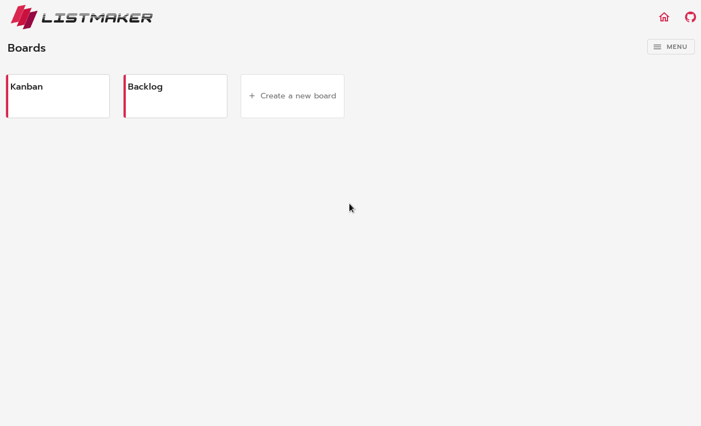

# List Maker - CQRS and Event Sourcing Example

This is the frontend app written in Vue.js for the [CQRS and Event Sourcing Example](https://github.com/renan-taranto/cqrs-event-sourcing-example) project.

<p align="center">
  
</p>

## Usage

### Instalation
1. Follow the [installation](https://github.com/renan-taranto/cqrs-event-sourcing-example#usage) instructions for the backend app and start it; 
2. Clone the repository:
```
$ git clone git@github.com:renan-taranto/list-maker.git
```

2. Move to the project directory:
```
$ cd list-maker
```

3. Install dependencies:
```
$ npm install
```

### Starting the application in development mode
```
$ npm run serve
```

### Compiles and minifies for production
```
$ npm run build
```

### Lints and fixes files
```
$ npm run lint
```

## Author

Renan Taranto (renantaranto@gmail.com)
